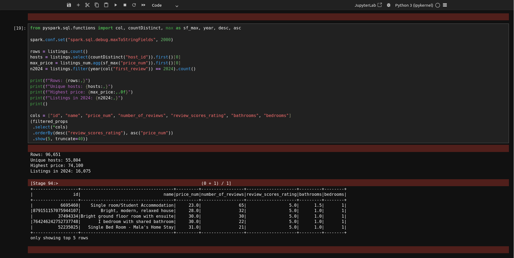

# Data Processing with Spark

This repository contains my solutions to exercises from *Section 02 – Big Data Processing with Apache Spark: Process & Analyze Real-World Airbnb Data* in the [ZTM Data Engineering Bootcamp](https://zerotomastery.io/courses/data-engineering-bootcamp/). It focuses on practicing core **PySpark DataFrame operations** using real-world Airbnb data for London.

The repository is structured into multiple exercise sets, currently including two sets of tasks:  

- **01 – Basic Functions**: Covers filtering, selecting, and basic aggregations  
- **02 – Aggregation Functions**: Focuses on joins, advanced aggregations, and working across multiple datasets (`listings.csv` and `reviews.csv`)

## Table of Contents
- [Data Processing with Spark](#data-processing-with-spark)
  - [Table of Contents](#table-of-contents)
  - [Overview](#overview)
  - [Dataset](#dataset)
  - [How to Run](#how-to-run)
  - [Notebook Exploration](#notebook-exploration)
    - [01 – Basic Functions](#01--basic-functions)
      - [Example Output](#example-output)
    - [02 – Aggregation Functions](#02--aggregation-functions)
  - [File Overview](#file-overview)
  - [What I Learned](#what-i-learned)
    - [From Basic Functions](#from-basic-functions)
    - [From Aggregation Functions](#from-aggregation-functions)
  - [Author](#author)
  - [Acknowledgments](#acknowledgments)

## Overview
The goal of this project is to strengthen my skills in **PySpark** by working with real data and solving common analytical tasks. It covers:

- Filtering, selecting, and aggregating data  
- Converting and cleaning numeric fields  
- Combining logical conditions with `&` and `|`  
- Extracting dates and computing statistics  
- Working with multiple datasets and performing joins

## Dataset
This project uses data from **Inside Airbnb** ([Get the Data](https://insideairbnb.com/get-the-data/)):

- **City:** London, England, United Kingdom  
- **Date:** 10 June 2025  
- **File used:** `data/listings.csv` (summary information and metrics for listings, expected to be placed inside a `data/` folder in the project root)

Although InsideAirbnb provides additional files (calendar, reviews, neighbourhoods),  
the following files are used in this project:  

- `listings.csv` (summary information and metrics for listings)  
- `reviews.csv` (individual review records, used in the aggregation exercises)

## How to Run
This project was developed and tested in an Ubuntu (Linux) environment, but should run on any OS with Python ≥3.10 and Java 17 installed.

1. **Clone the repository**
```bash
git clone https://github.com/dantvi/data-processing-with-spark.git
cd data-processing-with-spark
```

2. **Start Jupyter Notebook**
```bash
jupyter notebook
```
Open and run any of the available notebooks, e.g. `01-basic-functions.ipynb` or `02-aggregation-functions.ipynb`.  
Each exercise can also be executed directly using its corresponding `.py` script.

> **Note:** Make sure you have a folder named `data/` in the project root and place the `listings.csv` file inside it before running the notebook or script.

## Notebook Exploration

### 01 – Basic Functions
Covers 10 introductory tasks, including:
1. Selecting non-null `picture_url` values  
2. Counting properties with `reviews_per_month > 10`  
3. Filtering properties with more bathrooms than bedrooms  
4. Collecting properties where `price > 5000`  
5. Filtering by multiple conditions (price < 150, >20 reviews, rating > 4.5)  
6. Using the OR operator (`|`) to combine conditions  
7. Finding the highest listing price using `max()`  
8. Getting the name and price of the most expensive property  
9. Counting the number of unique hosts using `countDistinct`  
10. Getting listings with `first_review` in 2024 using `year()`  

#### Example Output
Here's a sample screenshot from the *Basic Functions* notebook, showing filtering, aggregations, and sorting in action:



### 02 – Aggregation Functions
Covers 7 aggregation and join tasks, including:
1. Counting the number of reviews per listing  
2. Computing the total number of listings and average review score per host  
3. Finding the top ten listings with the highest number of reviews  
4. Finding the top five neighbourhoods with the most listings  
5. Joining listings and reviews to display listing ID, listing name, reviewer name, and comments  
6. Finding the top five listings with the highest average review comment length (min 5 reviews)  
7. Using `left_anti` join to find listings without reviews

## File Overview
| File | Purpose |
|------|---------|
| `01-basic-functions.ipynb` | Jupyter Notebook with 10 Spark basics exercises |
| `01-basic-functions.py` | Script version of the notebook for running without Jupyter |
| `02-aggregation-functions.ipynb` | Jupyter Notebook with 7 aggregation & join exercises |
| `02-aggregation-functions.py` | Script version of the notebook for running without Jupyter |
| `README.md` | Project documentation |

## What I Learned

### From Basic Functions
- Creating and using a SparkSession in PySpark  
- Reading CSV files with schema inference and multiline support  
- Filtering and combining conditions with `&` and `|`  
- Cleaning and converting price strings with `regexp_replace` and `cast`  
- Using aggregations like `count`, `countDistinct`, and `max`  
- Extracting year values with `year()`  
- Collecting results into Python lists for further analysis  

### From Aggregation Functions
- Grouping and counting related data across multiple datasets  
- Calculating averages (e.g., review scores, comment lengths)  
- Using `countDistinct` and conditional filters  
- Performing joins (`inner`, `left`, `left_anti`) to combine or exclude records  
- Ranking results with `orderBy` to extract top-N subsets  
- Enforcing minimum thresholds (e.g., listings with ≥5 reviews)

## Author
- **GitHub** – [@dantvi](https://github.com/dantvi)
- **LinkedIn** – [@danieltving](https://linkedin.com/in/danieltving)

## Acknowledgments
- **ZTM Data Engineering Bootcamp** – for the project and curriculum
- **Inside Airbnb** – for the dataset
- **PySpark Documentation**